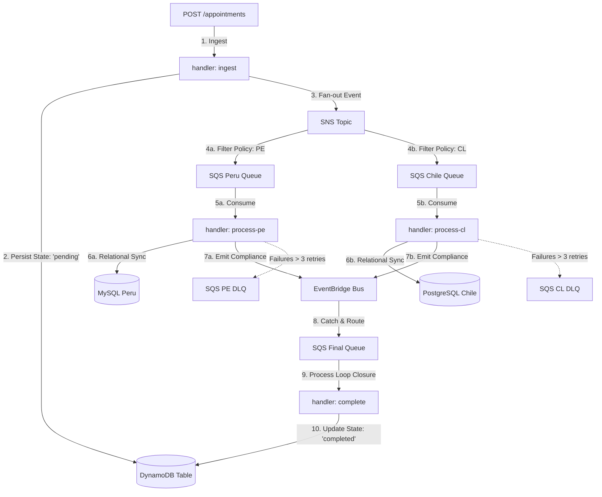

# 🔄 Event-Driven Architecture Lifecycle Flow & Fault Tolerance

This document outlines the complete asynchronous end-to-end lifecycle of a medical appointment request within the system, detailing the precise purpose of each AWS resource and its built-in resilience.

## 🗺️ Step-by-Step Execution Journey

### 📦 Component Responsibilities & Boundaries

#### 1. Ingestion Boundary (Synchronous Phase)

- **`POST /appointments`**: Receives the payload and runs it through the strict **Zod** schema boundary.
- **DynamoDB (`pending` state)**: Acts as the immediate transactional single source of truth. The record is initialized as `pending` to ensure instant data durability before launching any network-bound worker triggers.
- **Amazon SNS Topic**: Receives the compliance event and fans it out dynamically based on payload attributes.

#### 2. Geographical Distribution & Fault Tolerance Boundary (Asynchronous Phase)

- **SNS Message Filtering policies**: Inspects `countryISO` attributes automatically at the cloud infrastructure layer. If `"PE"`, the event goes exclusively to `SQS_PE`; if `"CL"`, it routes to `SQS_CL`.
- **Country Workers (`process-pe` & `process-cl`)**: Independent serverless processors consuming events at their own pace. They instantiate the dynamic **Kysely** connection engine to match their respective target relational engines (MySQL or PostgreSQL).
- **Resilience via Redrive Policy (DLQ)**: If a country worker crashes or loses network connectivity to its SQL database, the message automatically returns to the queue. SQS enforces a strict maximum retry count of 3 (`maxReceiveCount: 3`). If a poison-pill message fails continuously, SQS automatically routes it to its matching **`SQS_PE_DLQ`** or **`SQS_CL_DLQ`** to protect compute resources and prevent infinite loops.

#### 3. Lifecycle Loop Closure (`SQS_FINAL` Purpose)

- **Amazon EventBridge**: Intercepts `AppointmentConfirmed` synchronization tokens raised by the country workers once they commit rows successfully to their SQL servers.
- **`SQS_FINAL` (The Closure Queue)**: Acts as a buffer queue that intercepts the EventBridge routing target signals.
- **`complete` Handler**: Triggered exclusively by `SQS_FINAL`. Its sole atomic duty is to update the original transactional **DynamoDB** table record state from `pending` to `completed`, safely concluding the lifecycle.

### 🛡️ Global System Consistency and Integrity State

- **Data Isolation**: Relational workers focus purely on regional stores, agnostic to the global DynamoDB tables.
- **Guaranteed Traceability**: While a message is trapped in a country queue or a DLQ due to relational failures, the master record in DynamoDB remains perfectly preserved in a **`pending`** status. It will never transition to `completed` unless the worker safely flushes the transaction into the relational ecosystem, guaranteeing data harmony across database engines.
