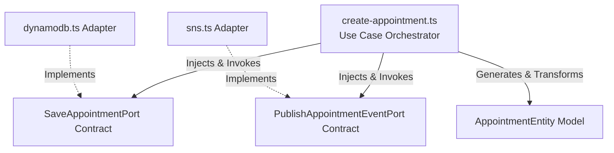
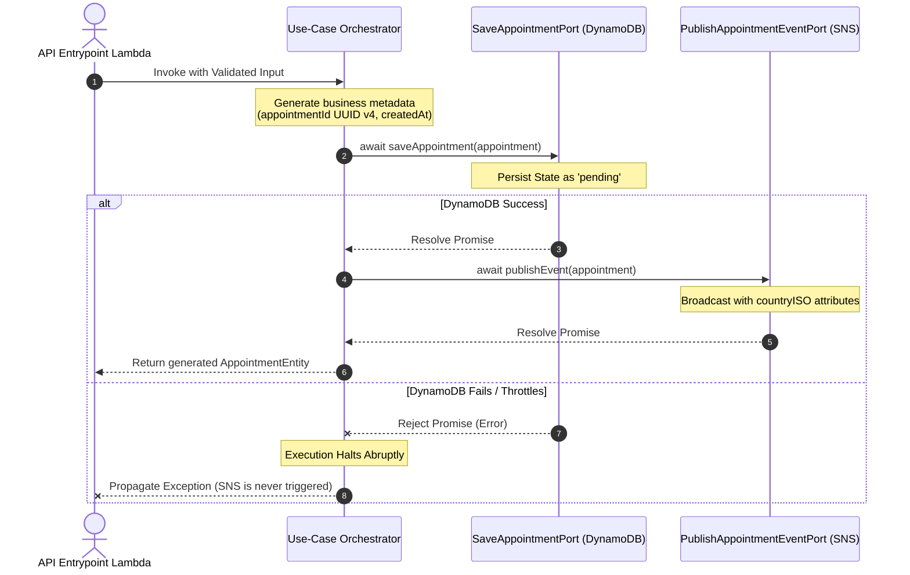

# Core Domain Architecture: Use-Case Design Patterns

This document details the architectural decisions, software engineering principles, and design patterns applied within the `create-appointment.ts` business orchestrator.

## 1. Clean Architecture Alignment

In accordance with **Clean Architecture** (and Hexagonal / Ports-and-Adapters patterns), the core domain layers must remain completely untainted by external technologies, cloud vendors, or framework drivers.

- **Technology Agnosticism:** The use-case orchestrator does not import `@aws-sdk/client-dynamodb` or `@aws-sdk/client-sns`. It is completely blind to AWS.
- **Business Immortality:** If the business decides to replace DynamoDB with MongoDB, or Amazon SNS with Apache Kafka, this core orchestrator file requires **zero modifications**, securing a long-lasting, resilient codebase.

---

## 2. SOLID Principles Adaptation (Functional Paradigm)

While SOLID originated in Object-Oriented Programming (OOP), its core values adapt seamlessly into Functional Programming (FP) and Pure Functions:

### S - Single Responsibility Principle (SRP)

The function `createAppointmentUseCase` has one atomic purpose: to manage the behavioral sequence of a medical appointment request lifecycle. It does not know _how_ to connect to a database, _how_ to parse JSON, or _how_ to serialize payloads over HTTP network sockets.

### D - Dependency Inversion Principle (DIP) & Functional Dependency Injection

High-level modules must never depend directly on low-level infrastructure modules; both must depend on abstractions.

- **The Ports:** `SaveAppointmentPort` and `PublishAppointmentEventPort` are our functional abstract contracts.
- **Injection over Singletons:** Instead of hardcoding imports or using heavy OOP Singleton class instances, dependencies are injected into the function as a destructured payload argument: `{ saveAppointment, publishEvent }`. This makes swapping data layers effortless.

---

## 3. Additional Architectural Pillars Applied

### Immutability & Pure Records

Instead of instantiating an object and mutating its properties over time (e.g., `appointment.status = 'pending'`), the use-case leverages the JavaScript spread operator (`...input`) to create a brand-new, completely frozen `readonly` record mapping. This guarantees data consistency across concurrent asynchronous execution threads.

### Sequential State Durability (Transaction Boundary)

The execution order inside the use-case is strictly sequential. As illustrated in the sequence diagram above, if the NoSQL storage layer fails or throttles, the function halts instantly, throwing an error. The message is **never published** to SNS, preventing downstream regional SQL workers from picking up corrupt, ghost, or out-of-sync transactions.

### 100% Deterministic Testability

Because all network I/O functions are abstracted away into ports passed as simple function parameters, unit testing this business logic with **Vitest** requires zero heavy network mocking tools. We can easily inject pure, lightning-fast spy functions as arguments to assert metadata and execution orders in milliseconds.
